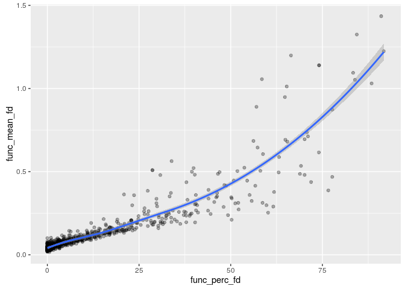
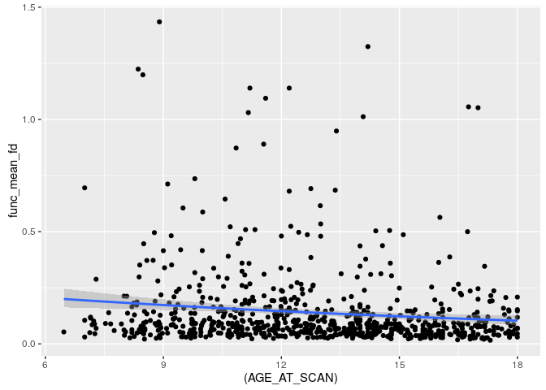
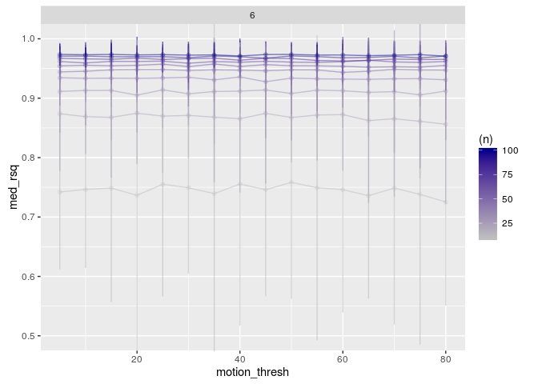
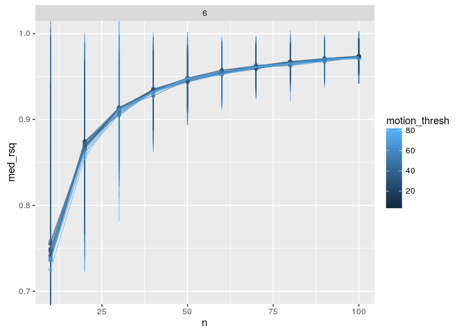

Understanding QC parameters
===========================

    library(ggplot2)
    #check how percent and mean fd are related:
    aDF_ <- read.csv('../../Phenotypic_V1_0b_preprocessed1.csv')
    aDF <- aDF_[aDF_$AGE_AT_SCAN >= 6 & aDF_$AGE_AT_SCAN <= 18,]
    aplot <- ggplot(aDF, aes(y=func_mean_fd, x=func_perc_fd))+
        geom_point(alpha=.3)+
        geom_smooth()
    print(aplot)

    ## Warning: Removed 13 rows containing non-finite values (stat_smooth).

    ## Warning: Removed 13 rows containing missing values (geom_point).

<!-- -->

    qplot(aDF$func_perc_fd)

    ## `stat_bin()` using `bins = 30`. Pick better value with `binwidth`.

    ## Warning: Removed 13 rows containing non-finite values (stat_bin).

<!-- -->

    summary(glm(round(func_perc_fd) ~ AGE_AT_SCAN, family='quasipoisson', data=aDF))

    ## 
    ## Call:
    ## glm(formula = round(func_perc_fd) ~ AGE_AT_SCAN, family = "quasipoisson", 
    ##     data = aDF)
    ## 
    ## Deviance Residuals: 
    ##    Min      1Q  Median      3Q     Max  
    ## -6.213  -4.047  -2.364   1.246  14.738  
    ## 
    ## Coefficients:
    ##             Estimate Std. Error t value Pr(>|t|)    
    ## (Intercept)  3.48868    0.22214  15.705  < 2e-16 ***
    ## AGE_AT_SCAN -0.07280    0.01771  -4.112 4.35e-05 ***
    ## ---
    ## Signif. codes:  0 '***' 0.001 '**' 0.01 '*' 0.05 '.' 0.1 ' ' 1
    ## 
    ## (Dispersion parameter for quasipoisson family taken to be 23.81071)
    ## 
    ##     Null deviance: 14826  on 756  degrees of freedom
    ## Residual deviance: 14420  on 755  degrees of freedom
    ##   (13 observations deleted due to missingness)
    ## AIC: NA
    ## 
    ## Number of Fisher Scoring iterations: 6

    ggplot(aDF, aes(x=(AGE_AT_SCAN), y=round(func_perc_fd)))+
        geom_point()+
        geom_smooth(method='glm', method.args=list(family='quasipoisson'))

    ## Warning: Removed 13 rows containing non-finite values (stat_smooth).

    ## Warning: Removed 13 rows containing missing values (geom_point).

<!-- -->

    summary(glm(func_mean_fd ~ AGE_AT_SCAN, family='quasipoisson', data=aDF))

    ## 
    ## Call:
    ## glm(formula = func_mean_fd ~ AGE_AT_SCAN, family = "quasipoisson", 
    ##     data = aDF)
    ## 
    ## Deviance Residuals: 
    ##      Min        1Q    Median        3Q       Max  
    ## -0.47203  -0.26273  -0.15806   0.02104   1.94635  
    ## 
    ## Coefficients:
    ##             Estimate Std. Error t value Pr(>|t|)    
    ## (Intercept) -1.24008    0.20548  -6.035 2.49e-09 ***
    ## AGE_AT_SCAN -0.05715    0.01622  -3.523 0.000453 ***
    ## ---
    ## Signif. codes:  0 '***' 0.001 '**' 0.01 '*' 0.05 '.' 0.1 ' ' 1
    ## 
    ## (Dispersion parameter for quasipoisson family taken to be 0.2156552)
    ## 
    ##     Null deviance: 100.098  on 756  degrees of freedom
    ## Residual deviance:  97.407  on 755  degrees of freedom
    ##   (13 observations deleted due to missingness)
    ## AIC: NA
    ## 
    ## Number of Fisher Scoring iterations: 5

    ggplot(aDF, aes(x=(AGE_AT_SCAN), y=func_mean_fd))+
        geom_point()+
        geom_smooth(method='glm', method.args=list(family='quasipoisson'))

    ## Warning: Removed 13 rows containing non-finite values (stat_smooth).

    ## Warning: Removed 13 rows containing missing values (geom_point).

<!-- -->

The percentage of volumes with motion \> threshold is basically a count
variable (normalized), so we should treat it as something like poisson
distributed (most people have only a few, bounded at 0, but some people
have a lot). We can predict the rate of bad volumes with age and find a
small decrease in the expected rate with age. This is as expected. All
this taken together can give us confidence that we are interpreting this
measure correctly.

Data checking
=============

    rsqDF <- read.csv('./RESULTS/SummaryRsqs.csv', stringsAsFactors=F)

    head(rsqDF) 

    ##   motion_thresh   med_rsq      CI_95   med_icc  CI_95_icc   n age_l age_u
    ## 1            45 0.9113502 0.14894686 0.9560125 0.06709182  30    13    16
    ## 2            50 0.9130510 0.11846852 0.9566213 0.05456147  30    13    16
    ## 3            10 0.9545049 0.07439385 0.9777355 0.03571818 300    14    17
    ## 4            30 0.9824655 0.02512164 0.9913838 0.01187193 300    11    14
    ## 5            20 0.9459763 0.05508039 0.9732650 0.02762873 210     6     9
    ## 6            20 0.9762827 0.02729964 0.9881639 0.01400458 240     9    12

    #Check frequencies and distributions
    table(rsqDF$motion_thresh)

    ## 
    ##   5  10  15  20  25  30  35  40  45  50 
    ## 100 100 100 100 100 100 100 100 100 100

    table(rsqDF$n)

    ## 
    ##  30  60  90 120 150 180 210 240 270 300 
    ## 100 100 100 100 100 100 100 100 100 100

    table(rsqDF$age_l-rsqDF$age_u)

    ## 
    ##   -3 
    ## 1000

    table(rsqDF[,c('motion_thresh', 'n')])

    ##              n
    ## motion_thresh 30 60 90 120 150 180 210 240 270 300
    ##            5  10 10 10  10  10  10  10  10  10  10
    ##            10 10 10 10  10  10  10  10  10  10  10
    ##            15 10 10 10  10  10  10  10  10  10  10
    ##            20 10 10 10  10  10  10  10  10  10  10
    ##            25 10 10 10  10  10  10  10  10  10  10
    ##            30 10 10 10  10  10  10  10  10  10  10
    ##            35 10 10 10  10  10  10  10  10  10  10
    ##            40 10 10 10  10  10  10  10  10  10  10
    ##            45 10 10 10  10  10  10  10  10  10  10
    ##            50 10 10 10  10  10  10  10  10  10  10

    table(rsqDF[,c('age_l', 'n')])

    ##      n
    ## age_l 30 60 90 120 150 180 210 240 270 300
    ##    6  10 10 10  10  10  10  10  10  10  10
    ##    7  10 10 10  10  10  10  10  10  10  10
    ##    8  10 10 10  10  10  10  10  10  10  10
    ##    9  10 10 10  10  10  10  10  10  10  10
    ##    10 10 10 10  10  10  10  10  10  10  10
    ##    11 10 10 10  10  10  10  10  10  10  10
    ##    12 10 10 10  10  10  10  10  10  10  10
    ##    13 10 10 10  10  10  10  10  10  10  10
    ##    14 10 10 10  10  10  10  10  10  10  10
    ##    15 10 10 10  10  10  10  10  10  10  10

    table(rsqDF[,c('motion_thresh', 'age_l')])

    ##              age_l
    ## motion_thresh  6  7  8  9 10 11 12 13 14 15
    ##            5  10 10 10 10 10 10 10 10 10 10
    ##            10 10 10 10 10 10 10 10 10 10 10
    ##            15 10 10 10 10 10 10 10 10 10 10
    ##            20 10 10 10 10 10 10 10 10 10 10
    ##            25 10 10 10 10 10 10 10 10 10 10
    ##            30 10 10 10 10 10 10 10 10 10 10
    ##            35 10 10 10 10 10 10 10 10 10 10
    ##            40 10 10 10 10 10 10 10 10 10 10
    ##            45 10 10 10 10 10 10 10 10 10 10
    ##            50 10 10 10 10 10 10 10 10 10 10

    ggplot(rsqDF, aes(x=med_rsq))+geom_histogram(aes(y=..density..))+geom_density()

    ## `stat_bin()` using `bins = 30`. Pick better value with `binwidth`.

<!-- -->

*R*2 plots
=====================

    #Plot the fun stuff

    n_color_age_facet <- ggplot(rsqDF, aes(x=motion_thresh, y=med_rsq, group=(n), color=(n)))+
        geom_errorbar(aes(ymin=med_rsq-CI_95/2, 
                  ymax=med_rsq+CI_95/2), 
                  width=0, alpha=.6)+
        facet_wrap(~age_l)+
        coord_cartesian(y=c(.5, 1))+
        scale_color_gradient(low='gray', high='darkblue')

    age_color_n_facet <- ggplot(rsqDF, aes(x=motion_thresh, y=med_rsq, group=factor(age_l), color=factor(age_l)))+
        geom_errorbar(aes(ymin=med_rsq-CI_95/2, 
                  ymax=med_rsq+CI_95/2), 
                  width=0, alpha=.2)+
        coord_cartesian(y=c(.8, 1))+
        facet_wrap(~n)

    plotThing <- function(aPlot){
        aPlot + 
            geom_point(alpha=.2)+
            geom_line(alpha=.5)+
            scale_x_continuous(trans='identity')+
            scale_y_continuous(trans='identity')
    }

    plotThing(n_color_age_facet)

<!-- -->

    plotThing(age_color_n_facet)

<!-- -->

ICC plots
=========

    ggplot(rsqDF, aes(x=med_icc))+geom_histogram(aes(y=..density..))+geom_density()

    ## `stat_bin()` using `bins = 30`. Pick better value with `binwidth`.

<!-- -->

    #Plot the fun stuff

    n_color_age_facet <- ggplot(rsqDF, aes(x=motion_thresh, y=med_icc, group=(n), color=(n)))+
        geom_errorbar(aes(ymin=med_icc-CI_95_icc/2, 
                  ymax=med_icc+CI_95_icc/2), 
                  width=0, alpha=.6)+
        facet_wrap(~age_l)+
        coord_cartesian(y=c(.5, 1))+
        scale_color_gradient(low='darkgray', high='darkblue')

    age_color_n_facet <- ggplot(rsqDF, aes(x=motion_thresh, y=med_icc, group=factor(age_l), color=factor(age_l)))+
        geom_errorbar(aes(ymin=med_icc-CI_95_icc/2, 
                  ymax=med_icc+CI_95_icc/2), 
                  width=0, alpha=.5)+
        coord_cartesian(y=c(.8, 1))+
        facet_wrap(~n)

    plotThing <- function(aPlot){
        aPlot + 
            geom_point(alpha=.5)+
            geom_line(alpha=.5)+
            scale_x_continuous(trans='identity')+
            scale_y_continuous(trans='identity')
    }

    plotThing(n_color_age_facet)

<!-- -->

    plotThing(age_color_n_facet)

<!-- -->

Within motion cutoffs
=====================

    within_cutoff_plot <- ggplot(rsqDF, aes(x=n, y=med_icc, group=motion_thresh, color=motion_thresh))+
        geom_errorbar(aes(ymin=med_icc-CI_95_icc/2, 
                  ymax=med_icc+CI_95_icc/2), 
                  width=0, alpha=.5)+
        coord_cartesian(y=c(.8, 1))+
        facet_wrap(~age_l)
    plotThing(within_cutoff_plot) 

<!-- -->
